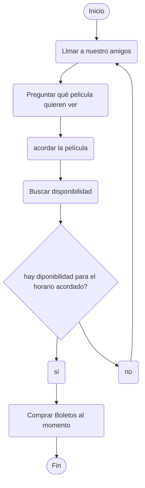

# Ejercicio 1: ir al cine

Representa en forma de Diagrama de flujo el algoritmo de comprar boletos para ir al cine con tus amigos

```mermaid
flowchart TD
    A([Inicio]) --> B
    B(Llmar a nuestro amigos) --> C
    C(Preguntar qué pelicula quieren ver) -->
    D(acordar la película) --> E
    E(Buscar disponibilidad) --> F
    F{hay diponibilidad para el horario acordado?} --> G
    G(si) --> H(Comprar Boletos al momento)
    F --> I(no)
    I --> B
    H --> J([Fin])
```
